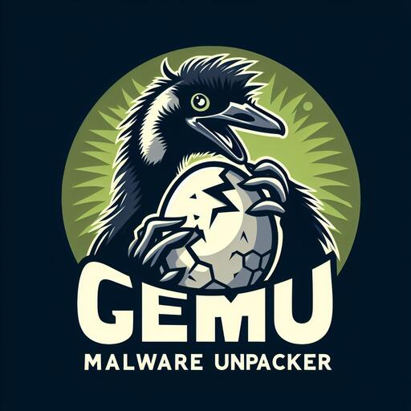

# GeMU


This repository contains the code for GeMU, the generic malware unpacker. This unpacker was presented at the WORMA workshop in 2025.
Please note that this is still a very early version. If you have any questions, suggestions, or feedback please reach out to us!

Citation: Jenke, Thorsten, Max Ufer, Manuel Blatt, Leander Kohler, Elmar Padilla, and Lilli Bruckschen, ``Democratizing Generic Malware Unpacking'' in 2025 IEEE European Symposium on Security and Privacy Workshops (EuroS\&PW), IEEE, 2025. (to appear).

## Building and Setup


### Install Requirements
- Make sure requirements to build QEMU are installed. E.g. for Ubuntu 22.04: 
  ```bash
  sudo apt-get install git libglib2.0-dev libfdt-dev libpixman-1-dev zlib1g-dev ninja-build
  ```
  If you have problems building gemu check the [official QEMU instructions](https://wiki.qemu.org/Hosts/Linux)

- Make sure additional dependencies for GeMU are installed:
  ```bash
  sudo apt-get install lsof genisoimage
  ```

- Make sure the Python requirements are installed
  ```bash
  cd <gemu-repo-dir>/gemu
  pip install -r requirements.txt
  ```
  
### Compile GeMU
Similar to regular QEMU build, but with some extra configure arguments.

```bash
cd <gemu-repo-dir>
mkdir build
cd build
../configure --target-list=x86_64-softmmu --disable-werror
make -j`nproc`
```

Note, that the the NFS support is broken on ArchLinux, thus this needs to be disabled for the build to succeed.

```bash
cd <gemu-repo-dir>
mkdir build
cd build
../configure --target-list=x86_64-softmmu --disable-werror --disable-libnfs
make -j`nproc`
```

### Build QEMU Image
- GeMU requires a QEMU image of Windows 7 or Windows 10.
- For faster installation, install Windows 7 or Windows 10 using VirtualBox or KVM
- Convert the virtualbox harddrive image to a QCOW2
  ```bash
  qemu-img convert -O qcow2 win10-disk001.vdi win10.qcow
  ```
- Launch the VM and build a snapshot in which an administrator CMD window is opened in the foreground with english locals

### Generating Symbol Mappings for GeMU and Setup API hoks
GeMU requires a symbol mapping that has to be created for the exact VM image used by GeMU.
- This step requires mounting of the VM image, which can be done e.g. by `guestmount`, provided on Ubuntu by the `libguestfs-tools` package.
- `guestmount` requires the specification of a partition. When the main partition holding `C:\` is e.g. the second one, set it to `/dev/sda2`.
- This has to be repeated for each Windows version before starting the sandboxing.

```bash
mkdir /path/to/a/mountpoint
sudo guestmount -o allow_other -a /path/to/VM_Image.qcow -m /dev/sda2 --ro /path/to/a/mountpoint
python3 generate_symbol_mapping.py --path /path/to/a/mountpoint --outfile ~/.gemu/symbol_mapping.txt
sudo guestunmount /path/to/a/mountpoint
rmdir /path/to/a/mountpoint
```

### Configuring GeMU
You need to enter the VM details in a config file:

```bash
cd <gemu-repo-dir>/gemu/gemuinteractor
cp config.py.template config.py
# Edit as required
$EDITOR config.py
```


## Usage
GeMU comes with scripts to:
- unpack single files
- unpack multiple files
- unpack a file with a predifined "recipe"

Below are simple example uses of these three scripts.
To learn more about all available options and parameters, try the `--help` flag.

Make sure you are in the right directory:
```bash
cd <gemu-repo-dir>/gemu
```

### Single File
```bash
python3 unpack_single_file.py --sample path/to/binary --time 60
```


### Multiple Files
```bash
python3 unpack_multiple_file.py --samples folder/with/samples --malpediamode
python3 unpack_multiple_file.py --samples samples_list.txt --yararules rules.yar
python3 unpack_multiple_file.py --samples sample_folders_list.txt --allowduplicateruns
```

### With Recipe 
```bash
python3 unpack_with_recipe.py --sampleyml recipe.yml
```
An example recipe can be found at `<gemu-repo-dir>/gemu/gemuinteractor/example.yml`.

## Roadmap
- [ ] per-thread matching of syscall/sysret pairs
- [x] prevent unpacking from failing when mounting takes longer than expected
- [ ] PE-carving
- [ ] improve .NET unpacking capabilities
